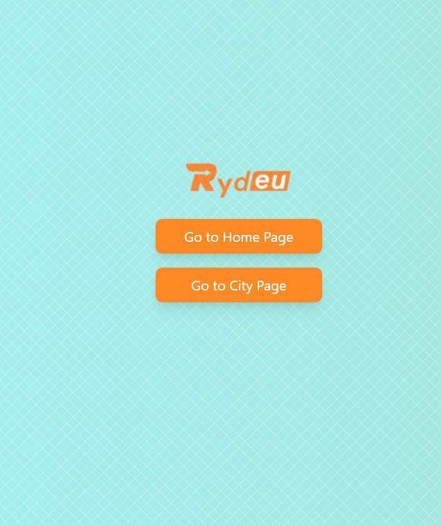
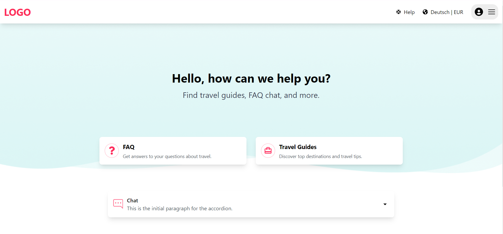
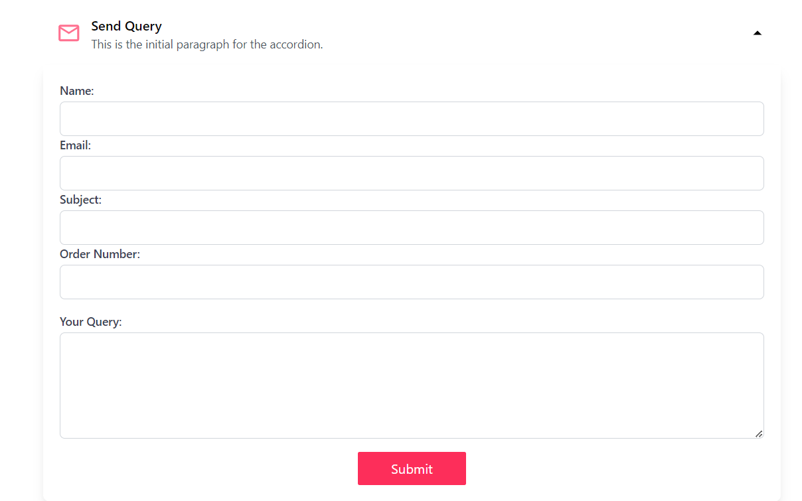
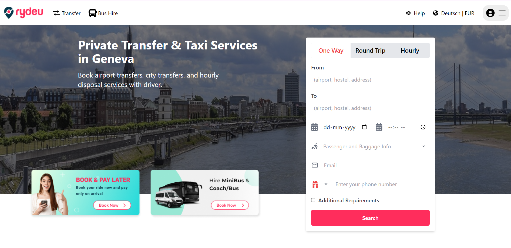
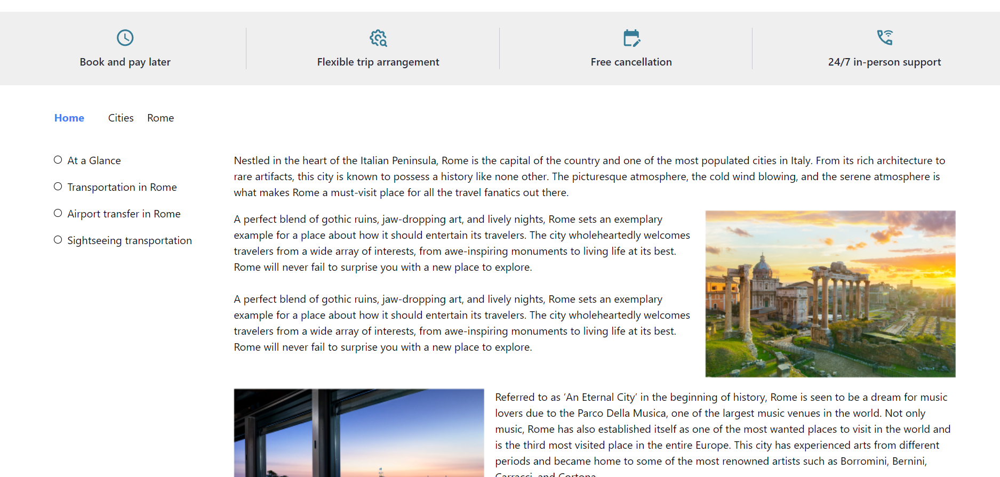

# React Travel Application

This repository contains the source code for a travel application built using React. The application includes a homepage (`HomePage`) with a navigation bar, welcome message, and information cards for travel guides and FAQs. It also features a city page (`CityPage`) that allows users to book private transfers and taxi services in different cities, along with additional content such as blogs and other cities' information.

## Table of Contents

- [Overview](#overview)
- [Features](#features)
- [Installation](#installation)
- [Usage](#usage)
- [Screenshots](#screenshots)
- [Contributing](#contributing)
- [License](#license)

## Overview

The application is designed to help users plan their travels by providing guides, FAQs, and booking services for private transfers and taxis in different cities. Users can also explore related content such as blogs and other cities' information.

## Features

- **Homepage**: 
  - Welcome message with travel guides and FAQs.
  - Information cards for FAQs and travel guides.
  - Drop-down info and registration form.

- **CityPage**:
  - Booking options: One Way, Round Trip, and Hourly services.
  - Form for booking private transfers and taxi services.
  - Additional content such as blogs and other cities' information.

- **Responsive Design**:
  - The application is designed to be responsive and works well on different screen sizes.

## Installation

1. Clone the repository:

    ```bash
    git clone <repository-url>
    ```

2. Navigate to the project directory:

    ```bash
    cd <project-directory>
    ```

3. Install dependencies using npm or yarn:

    ```bash
    npm install
    # or
    yarn install
    ```

## Usage

1. Start the development server:

    ```bash
    npm start
    # or
    yarn start
    ```

2. The application should be running at `http://localhost:3000/`.

## Screenshots

Here are some screenshots of the application:

<div style="display: flex; flex-wrap: wrap; justify-content: space-around; gap: 10px;">
  
  
  
  
  
</div>


## Contributing

We welcome contributions from the community. If you would like to contribute, please follow our [contributing guidelines](CONTRIBUTING.md) and open a pull request.

## License

This project is licensed under the [MIT License](LICENSE).

